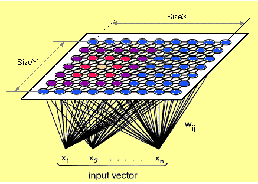
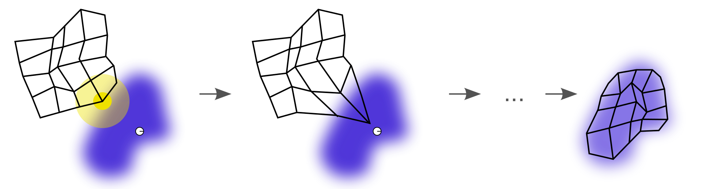

```{r setup, include=FALSE}
library(rmdformats)
knitr::opts_chunk$set(echo = TRUE)

library(dplyr)
```

# Introduction Self-Organizing Maps (SOM)

Self-Organizing Maps first introduce by Teuvo Kohonen. According to the `Wiki`, Self-Organizing Map (SOM) or self-organizing feature map (SOFM) is a type of artificial neural network (ANN) that is trained using unsupervised learning to produce a low-dimensional (typically two-dimensional), discretized representation of the input space of the training samples, called a map, and is therefore a method to do dimensionality reduction[^1]. SOM also represent clustering concept by grouping the similar features to be in a group. So, SOM can use to cluster high-dimensional data sets by doing dimensionality reduction and visualize it using maps[^2].

<center>  </center>

Each data point in the dataset recognized each other to represent one group. The first step in SOM is inisialize weight of vector. From initializing each weight of vector, there were a vector that randomly selected and looking for the map of weight vector to find the weight that represent those sample. Each weight vector has weight in closer vector. Closer vector will called as neighbor. Each neighbor will giving weight by some vector that ramdomly selected. From this step will create some map that has various shape. In general, the map is shaped by square or hexagonal in two dimensional space. 

SOM calculate the distance of each input vector by each weight of nodes. Distance that usually used is Euclidean distance.  

*Algoritma SOM[^3] :*

1. Preparing input data for training datasets.
2. Each node’s weights are initialized. A vector is chosen by randomly selected in training dataset. 
3. Calculate the distance of each node. The winning node is commonly known as the Best Matching Unit (BMU).
4. Updating of weight, then calculate again which one's weights are most like the input vectors. 
5. Every BMU has a neighbour then calculated. The amout of neighbour is decrease over time. 
6. The winning weight is rewarded with becoming more like the sample vector. The neighbors also become more like the sample vector. The closer a nodes to the BMU, the more its weights get altered and the farther away the neighbor from the BMU, the less it learns.
7. Repeat the 2-5 step until every node getting close to input vectors. 
 
 <center>  </center>
 
*Implementation use case for SOM algorithm :*

1. Customer segmentation[^3]
2. Fantasy league analysis
3. Cyber profilling criminals
4. Identifying crime
5. etc.


# SOM Analysis

On this article, we want to use `web analytics` dataset in San Francisco. We want to learn *how to use SOM to identify characteristics of each cluster* in many web on San Francisco by some features.

## Library Used
On this article, we used `kohonen` package for making a SOM algorithm. Since we know that `kohonen` packages are from `class`, we use it to make many key function such as :

 - *somgrid()* : initialized SOM node set
 - *som()* : making a SOM model, change the radius of neighbourhood, learning rate, and iteration
 - *plot.kohonen()* / *plot()* : visualisation of resulting SOM
 
```{r, message=FALSE}
library(kohonen)
```

In this article, we want to use `ads data` from xyz company that make an ads on Facebook. 

## Data Pre-Processing
```{r}
ads <- read.csv("data_input/KAG_conversion_data.csv") %>% 
  glimpse()

ads <- ads %>% 
  mutate(ad_id = as.factor(ad_id),
         xyz_campaign_id = as.factor(xyz_campaign_id),
         fb_campaign_id = as.factor(fb_campaign_id)) %>% 
  glimpse()

levels(ads$xyz_campaign_id)
```
 - `ad_id` : an unique ID of each ad
 - `xyz_campaign_id` : an ID associated with each ad campaign of XYZ company
 - `fb_campaign_id` : an ID associated with how Facebook tracks each campaign
 - `age` : age of the person to whom the ad is shown
 - `gender` : gender of the person to whon thw ad si shown
 - `interest` : a code specifying the category to which the person’s interest belongs (interests are as mentioned in the person’s Facebook public profile)
 - `Impressions` : number of time the ad is shown
 - `Clicks` : number od click on for the ad
 - `Spent` : amount paid from xyz company to Facebook to shown the ad
 - `Total_Conversion` : total number of people who enquired about the product after seeing the ad
 - `approved_Conversion` : total number of people who bougth the product after seeing the ad

As we know that if SOM used numerical data, so if we have chategorical variables we must to change those variable to dummy variables.
```{r}
# change the chategoric variables to a dummy variables
ads.s <- ads %>% 
  mutate(genderM = ifelse(gender == "M", 1, 0),
         age2 = ifelse(age == "35-39", 1, 0),
         age3 = ifelse(age == "40-44", 1, 0),
         age4 = ifelse(age == "45-49", 1, 0)) %>% 
  select(-c(1,3:5))

# make a train data sets that scaled and convert them to be a matrix cause kohonen function accept numeric matrix
ads.train <- as.matrix(scale(ads.s[,-1]))
```


```{r}
# make a SOM grid
set.seed(100)
ads.grid <- somgrid(xdim = 10, ydim = 10, topo = "hexagonal")

# make a SOM model
set.seed(100)
ads.model <- som(ads.train, ads.grid, rlen = 500, radius = 2.5, keep.data = TRUE,
                  dist.fcts = "euclidean")
# str(ads.model)
```
From that summary of `ads.model` we know that our som grid has 10x10 dimension. 

# Unsupervised SOM
## Visualize of SOM {.tabset .tabset-fade .tabset-pills}

Before visualize SOM model, let's explore list of SOM model. If we want to know that our data position in maps, we look it in `unit.classif`. Each values represent the node number to which this application belong. For example, in first value of application, 12 means that in first application has been claaified into 12 particular nodes. 
```{r, eval=FALSE}
ads.model$unit.classif
```

And we can see the classification of each nodes by codes plot and we can see the values of each nodes using the mapping plot.

```{r, fig.width=10}
plot(ads.model, type = "mapping", pchs = 19, shape = "round")
```


```{r}
head(data.frame(ads.train), 20)
```

```{r, fig.width=20}
plot(ads.model, type = "codes", main = "Codes Plot", palette.name = rainbow)
```

At the first node, we can say that the input data entered on the first node is characterized from the major variable tat have gender M and age range of 30-34. For the second node there is characterized of major variables that have gender M and age range 30-34. Here we can conclude that the node will have neighbors that have similar characteristics to it, that is, like nodes 1 and 2 that are close together because they have gender M and an age range of 30-34 that same.  

### Training Progress

In the SOM training iterations progress, the distance from each node’s weights to the samples represented by that node is reduced. In the progress, the distance should decrease over time and reach minimum distance. This plot shows the progress over time of decreasing distance. If in this training progress curve is continually decreasing, we should add more iteration.
```{r}
plot(ads.model, type = "changes")
```

### Node Counts

The Kohonen packages allows us to visualize how many samples are mapped to each node on the map. This metric can be used as a measure of map quality. In general, the sample distribution is uniform. Large values in some map areas suggests that a larger map would be benificial. If you find the empty nodes, it indicates that your map size is too big for your dataset. It's better when in your nodes has at least 5-10 samples when creating and choose the map size[^4].

```{r, fig.width=20}
plot(ads.model, type = "counts")
```

Nodes that colored by red mean nodes that have the least number of input values, such as in the second nodes. If the color nodes are brighter indicating the nodes have a lot of input values, such as in the 31 nodes. For nodes that have gray colors, that means the nodes do not have input values at all.

### Neighbours Nodes

If we want to see nodes that have the closest or farthest neighbours, we can plot a plot based on `dist.neighbours`. Nodes that have darker colors mean that the nodes have a vector input that is closer, whereas nodes that have lighter colors mean that the nodes have vector inputs that are farther apart.

```{r, fig.width=20}
plot(ads.model, type = "dist.neighbours")
```


### Heatmaps

Heatmaps are the most important visualization in SOM. SOM heatmap visualize the distribution of single variable across the map[^5]. In general, SOM creating multiple heatmaps to find interesting area by comparing each heatmaps. Remember that each individual sample not move from their position in each heatmaps, but it colored by different variables.

The default Kohonen heatmap is created by using the type “heatmap”, and then providing one of the variables from the set of node weights. In this case we visualise the average education level on the SOM.
```{r, fig.width=20}
heatmap.som <- function(model){
  for (i in 1:10) {
   plot(model, type = "property", property = getCodes(model)[,i], 
        main = colnames(getCodes(model))[i]) 
  }
}
heatmap.som(ads.model)
```

From the heatmap that is formed, we can know which nodes have the characteristics of each variable whose value is high and the value is low.

### Clustering 

Then we want to try to clustering every observation that we have without looking the labels of `xyz_campaign_id`. Like making cluster using k-means, we must determine the number of cluster that we want to make. In this case, we want to use elbow method to determine number of cluster.


```{r, fig.width=20, message=FALSE}
library(factoextra)
set.seed(100)
fviz_nbclust(ads.model$codes[[1]], kmeans, method = "wss")
set.seed(100)
clust <- kmeans(ads.model$codes[[1]], 6)

# clustering using hierarchial
# cluster.som <- cutree(hclust(dist(ads.model$codes[[1]])), 6)
```


```{r, fig.width=20}
plot(ads.model, type = "codes", bgcol = rainbow(9)[clust$cluster], main = "Cluster Map")
add.cluster.boundaries(ads.model, clust$cluster)
```
At this part, to do the profiling of the clusters that we made, we do not need to look at the descriptive results of the cluster or look deeper into the data, we only need to look at the cluster map above.

The characteristics for each cluster :

 - Cluster 1 (red) : gender Male, age 30-34
 - Cluster 2 (orange) : gender Female, gender Male, age 40-44, interest middle
 - Cluster 3 (green light) : gender Female, gender Male,  age 45-49, interest high, impression middle, clicks middle
 - Cluster 4 (green) : interest high, impression high, clicks high, spent high, gender Male, age 30-34, total conversion high, approved conversion high
 - Cluster 5 (turqois) : gender Male, age 45-49, interest high, clicks and spent low
 - Cluster 6 (blue) : gender Female, age 45-49, interest, impression, clicks, spent, total_conversion low.

```{r}
# know cluster each data
ads.cluster <- data.frame(ads.s, cluster = clust$cluster[ads.model$unit.classif])
tail(ads.cluster, 10)

```


# Supervised SOM
In supervised SOM, we want to classify our SOM model with our dependent variable (xyz_campaign_id). 
```{r}
# split data
set.seed(100)
int <- sample(nrow(ads.s), nrow(ads.s)*0.8)
train <- ads.s[int,]
test <- ads.s[-int,]

# scaling data
trainX <- scale(train[,-1])
testX <- scale(test[,-1], center = attr(trainX, "scaled:center"))


# make label
train.label <- factor(train[,1])
test.label <- factor(test[,1])
test[,1] <- 916
testXY <- list(independent = testX, dependent = test.label)
```
## Classification
```{r}
# classification & predict
set.seed(100)
class <- xyf(trainX, classvec2classmat(train.label), ads.grid, rlen = 500)
```

```{r}
plot(class, type = "changes")
```
## Predict
```{r}
pred <- predict(class, newdata = testXY)
table(Predict = pred$predictions[[2]], Actual = test.label)
```
## Cluster Boundaries
```{r, fig.width=20}
plot(ads.model, type = "codes", bgcol = rainbow(9)[clust$cluster], main = "Cluster SOM")
add.cluster.boundaries(ads.model, clust$cluster)
```


```{r, fig.width=20}
c.class <- kmeans(class$codes[[2]], 3)
par(mfrow = c(1,2))
plot(class, type = "codes", main = c("Unsupervised SOM", "Supervised SOM"), 
     bgcol = rainbow(3)[c.class$cluster])
add.cluster.boundaries(class, c.class$cluster)
```

From the results of SOM clustering using unsupervised and supervised, we can conclude that for xyz_campaign_id 916 more interested in the ads displayed are Male and Female aged 30-49 and they are interested in existing ads and then make payments after seeing the ads.
For xyz_campaign_id 936, those who see the ads is Male and Female in ranging age from 30-39 and they are only interested in the ads that are displayed but to make payments after seeing the ads are small.
For xyz_campaign_id 1178, which saw more ads for Female and aged 30-34 years.


*Advantage using SOM :*

 - Intuitive method to develop profilling
 - Easy to explain the result with the maps
 - Can visualize high-dimensional data by two-dimensional maps
 
*Disadvantage using SOM :*

 - Requires clean, numeric data

## Learning by Building

Make a clustering SOM using `Web_Analytics.csv` datasets. You can make clustering using unsupervised method or supervised method. If using unsupervised method, to determine k please use Elbow method using kmeans. Make an insight that you can get from your work.

Happy trying!
 
# Annotation

[^1]: [Wikipedia. Self-organizing Maps.](https://en.wikipedia.org/wiki/Self-organizing_map)

[^2]: [Ralhan, A. 2018. _Self Organizing Maps_.](https://towardsdatascience.com/self-organizing-maps-ff5853a118d4)

[^3]: [Lynn, Shane. Self-Organizing Maps for Customer Segementation using R.](https://www.shanelynn.ie/self-organising-maps-for-customer-segmentation-using-r/)

[^4]: [Self Organizing Maps](https://www.superdatascience.com/blogs/self-organizing-maps-soms-how-do-self-organizing-maps-learn-part-1/)

[^5]: [The Ultimate Guide to Self Organizing Maps (SOMs)](https://www.superdatascience.com/blogs/the-ultimate-guide-to-self-organizing-maps-soms)
 
 
